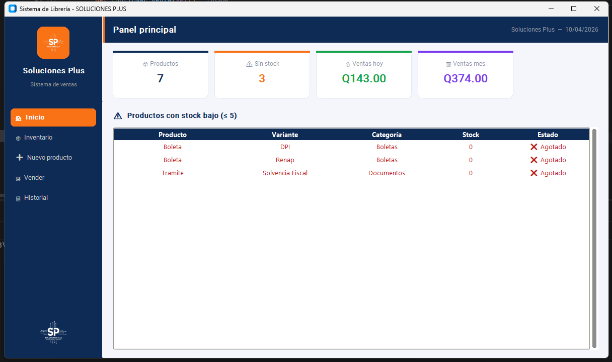

### Descargar la aplicación INNO SETUP
* https://jrsoftware.org/isdl.php

### INSTALAR PRIMERO PyInstaller 
* https://pyinstaller.org/en/stable/
````bash
pip install -U pyinstaller
````

### Descargar el NODEJS en zip 
* https://nodejs.org/en/download


# build 1
```bash 
pyinstaller --onefile --noconsole --icon=imagenes/icono.ico --name SISTEMA_SP --add-data "imagenes;imagenes" main.py
``` 

# build 2
```bash 
pyinstaller SISTEMA_SP.spec
``` 

- Para sacar el nombre de la computadora en el terminal
````bash
whoami
````


http://localhost:5001/